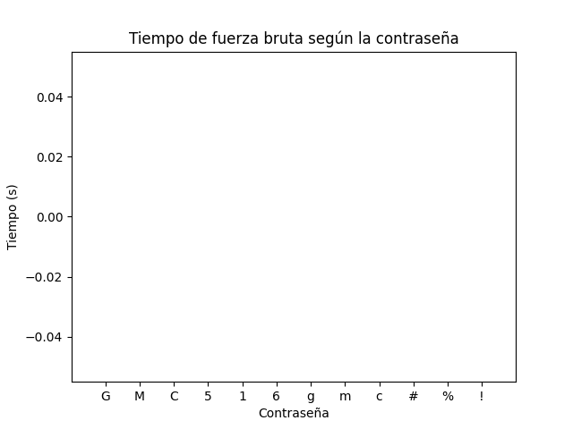
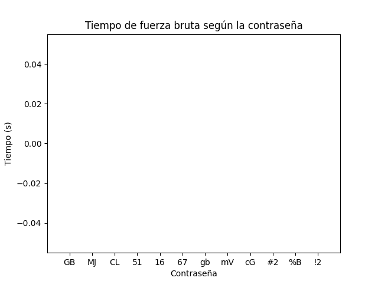
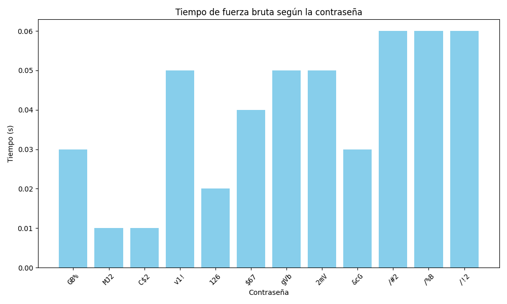

# Fuerza bruta controlada — Actividad de seguridad

## Tabla de contenido


- Uso
- Ejemplos de salida
- Diseño del algoritmo
- Experimentos y resultados
- Gráficas
- Reflexión
- Estructura del repositorio
- Requisitos
- Créditos

## Descripción

Este repositorio contiene un algoritmo de fuerza bruta que prueba combinaciones de caracteres para descifrar contraseñas definidas por el usuario. El script bruteforce.py solicita al usuario ingresar una contraseña de máximo 3 dígitos y luego intenta adivinarla mediante la prueba repetitiva de todas las combinaciones posibles de caracteres en un alfabeto predefinido que incluye mayúsculas, minúsculas, números y caracteres especiales. Una vez encontrada la contraseña, el script muestra un mensaje de éxito junto con el número de intentos realizados y el tiempo total empleado.
El objetivo de este proyecto es demostrar por qué las contraseñas cortas o simples son vulnerables a ataques de fuerza bruta. Los resultados muestran que, mientras más larga y compleja sea la contraseña, más difícil y tardado es para el algoritmo descifrarla. Esto destaca la importancia de utilizar contraseñas seguras y complejas para proteger la información

## Objetivo

- Comprender el funcionamiento y el impacto de los ataques de fuerza bruta en la seguridad de contraseñas.
- Demostrar la importancia de contraseñas seguras y complejas para proteger la información.
- Analizar y visualizar cómo la longitud y complejidad de una contraseña afectan el tiempo y el número de intentos necesarios para descifrarla mediante fuerza bruta.

## Requisitos

- **Python 3.8+** (recomendado 3.10 o superior).  
- **pip** (gestor de paquetes de Python).  
- (Opcional) **matplotlib** para las gráficas.

## Uso

1. Ejecutar el script principal:
```bash
python bruteforce.py

```
2 ) Seguir las instrucciones en consola:

- Ingresar la contraseña de prueba (máximo 3 caracteres en esta versión).

- El programa probará todas las combinaciones posibles del alfabeto predefinido (mayúsculas, minúsculas, números y símbolos).

3 ) Resultado esperado:

- Al encontrar la contraseña, el programa mostrará:

La contraseña encontrada

Número de intentos realizados

Tiempo total empleado en segundos

**Ejemplo de salida:**

Digite la contraseña: 123
Contraseña Encontrada...
Número de intentos: 15
Tiempo Empleado: 0.01 segundos


## Diseño del algoritmo

El algoritmo de fuerza bruta implementado sigue los siguientes pasos:

1. **Definir la contraseña de prueba**  
   - El usuario ingresa una contraseña de hasta 3 caracteres para probar el algoritmo.

2. **Definir el alfabeto de caracteres**  
   - El alfabeto incluye mayúsculas, minúsculas, números y símbolos especiales.  
   - Todas las combinaciones posibles se generarán a partir de este conjunto.

3. **Generar combinaciones secuenciales**  
   - El algoritmo prueba todas las combinaciones posibles de longitud 1, 2 y 3.  
   - Primero se prueban contraseñas de un solo carácter, luego de dos, y finalmente de tres.

4. **Comparar cada combinación con la contraseña objetivo**  
   - Si la combinación coincide con la contraseña ingresada, se detiene la búsqueda.  
   - Se registra el número de intentos realizados y el tiempo total empleado.

5. **Salida del programa**  
   - Contraseña encontrada o mensaje de no encontrada (si se exceden las combinaciones).  
   - Número de intentos y tiempo de ejecución en segundos.

6. **Visualización (opcional)**  
   - Con el script `graficas.py` se pueden generar gráficos que muestran el tiempo requerido para romper cada contraseña, permitiendo analizar cómo la longitud y complejidad afectan el rendimiento del ataque.

## Experimentos

Para evaluar el algoritmo de fuerza bruta se realizaron pruebas con contraseñas de diferentes longitudes y complejidades.

### Procedimiento
1. Ingresar contraseñas de prueba cortas (1 a 3 caracteres) en `bruteforce.py`.  
2. Registrar el **número de intentos** y el **tiempo de ejecución** que tarda el algoritmo en adivinar la contraseña.  
3. Repetir las pruebas variando el tipo de caracteres:
   - Solo minúsculas
   - Minúsculas + mayúsculas
   - Minúsculas + mayúsculas + números
   - Alfabeto completo (incluyendo símbolos)

### Observaciones
- El tiempo y el número de intentos crecen exponencialmente con la longitud de la contraseña.  
- Contraseñas con más tipos de caracteres (mayúsculas, números, símbolos) tardan más en ser descubiertas.  
- Para contraseñas largas (8+ caracteres), el tiempo de ejecución se vuelve impráctico, demostrando la importancia de usar combinaciones complejas.

### Analogía

Para entender el funcionamiento del algoritmo se puede hacer una analogía con un **candado o sello de bicicleta**:  
- Cada carácter de la contraseña es como un número o letra del candado.  
- El algoritmo de fuerza bruta prueba todas las combinaciones posibles, igual que girar cada número del candado hasta encontrar la combinación correcta.  
- Esta analogía permite visualizar por qué los candados (o contraseñas) más largos y complejos tardan mucho más en abrirse que los cortos y simples.


### Visualización
- Se utiliza el script `graficas.py` para generar gráficos de barras mostrando el tiempo requerido para cada contraseña.  
- El eje X representa las contraseñas probadas, y el eje Y el tiempo en segundos.  
- Esto permite **comparar visualmente** el impacto de la longitud y complejidad de la contraseña sobre la eficiencia del ataque.

## Gráficos







### Visualización de contraseñas y tiempo de fuerza bruta

Estas gráfica muestran el **tiempo que tarda el algoritmo de fuerza bruta** en adivinar diferentes contraseñas de prueba.

Donde: 
- **Eje X (Contraseña):** representa cada contraseña utilizada en el experimento.  
- **Eje Y (Tiempo en segundos):** muestra el tiempo que tomó el algoritmo para descifrar la contraseña.  
- **Barras:** cada barra indica el tiempo total requerido para encontrar la contraseña correspondiente.

Para analizar el impacto de la longitud de la contraseña, se generaron gráficos separando las contraseñas según el **número de caracteres (índices)**:

1. **Contraseñas de 1 carácter:** cada barra representa una contraseña de un solo carácter. Permite observar cuánto tarda el algoritmo en adivinar contraseñas muy cortas.  
2. **Contraseñas de 2 caracteres:** cada barra representa una combinación de dos caracteres. Aquí no se nota que el tiempo empiece a incrementarse debido  a que la contraseña es sumamente débil.   
3. **Contraseñas de 3 caracteres:** cada barra muestra combinaciones de tres caracteres. Esta sección refleja cómo el tiempo crece de manera exponencial a medida que aumenta la longitud de la contraseña.

**Interpretación:**  

- Grafica #1

- Aunque en este ejemplo los tiempos son muy bajos (contraseñas cortas), la gráfica sirve para demostrar el concepto: **contraseñas más largas o con mayor complejidad (mayúsculas, números, símbolos) tardan más tiempo en ser descubiertas** mediante fuerza bruta.  
- Dividir los gráficos por longitud facilita visualizar **la relación entre el tamaño de la contraseña y el tiempo de descifrado**.

- Grafica #2

- En este ejemplo los tiempo siguen siendo bastantes bajos, la gráfica es similar a la primera debido a lo débil que es la contraseña.

- Grafica #3


  La gráfica muestra el tiempo que tarda el algoritmo de fuerza bruta en descifrar distintas contraseñas de 3 caracteres.  

  Se observa que contraseñas más simples o con combinaciones de caracteres más predecibles (`MJ2`, `C$2`) son descifradas más rápidamente, mientras que contraseñas con símbolos o mezclas de letras y números (`v1!`, `$67`, `2mV`, `/!2`) tardan más.  

  Esto evidencia que, incluso con contraseñas cortas, la complejidad de los caracteres influye en la dificultad del descifrado mediante fuerza bruta. A medida que aumente la longitud o se amplíe el alfabeto de caracteres, las diferencias en los tiempos de descifrado serían aún más notorias.  

## Reflexión


- ¿Qué pasa con contraseñas 8+ con mayúsculas/números/símbolos?

Como se puede observar en los gráficos, cada vez que se añade un carácter y se modifica su patrón, el tiempo y el número de intentos aumentan considerablemente. Por lo tanto, si se aumenta el número de caracteres a 8 y se varía el patrón para incluir mayúsculas, números y símbolos, el tiempo aumentaría de manera exponencial, lo que haría que la contraseña sea extremadamente segura. Esto demuestra la importancia de utilizar contraseñas complejas y largas para proteger la información de manera efectiva.


## Conclusión
Los resultados obtenidos mediante el algoritmo de fuerza bruta demuestran que las contraseñas cortas o simples son altamente vulnerables a ataques automatizados. Incluso combinaciones de 2 o 3 caracteres con símbolos pueden ser descifradas en tiempos muy reducidos.  
Este experimento evidencia que la longitud y la complejidad de una contraseña son factores importantes para proteger la información, ya que incrementan exponencialmente el número de combinaciones posibles y, por ende, el tiempo necesario para un ataque exitoso.
 


## Estructura del repositorio
:
/ (raíz)
├─ bruteforce.py # script principal
├─ graficas.py # genera gráficos desde resultados
├─ README.md
└─ Graficos/ # capturas


